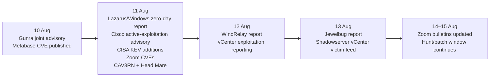
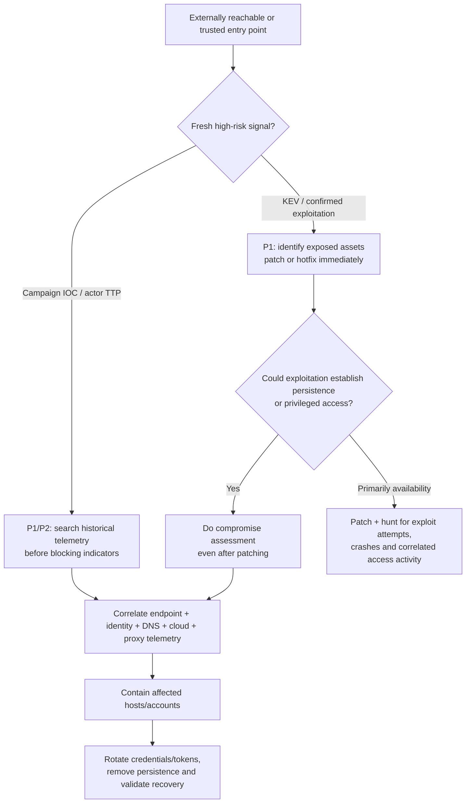

# Recent Cyber Threat Intelligence for Proactive Threat Hunting

**Reporting window:** 9–15 August 2026 inclusive  
**Reporting context:** Europe/London  
**Research cut-off:** 15 August 2026

> **Repository note:** This is the authoritative deep-research version of the 15 August threat-hunting assessment. ChatGPT runtime citation tokens have been removed because they do not resolve outside the original research session. Source publishers and research organizations are retained throughout the text so that primary material can be traced independently.

## Executive summary

This assessment covers **9–15 August 2026 inclusive**, using Europe/London as the reporting context and a research cut-off of **15 August 2026**. Eligibility is based on a material intelligence signal during that window—new disclosure, new campaign reporting, a new government/vendor advisory, or new confirmation of exploitation—rather than requiring the underlying malicious activity itself to have begun during those seven days. That distinction matters: several of the most actionable reports published this week describe exploitation that started days or weeks earlier.

The strongest immediate signal is the convergence of **confirmed exploitation and privileged infrastructure**. On 11 August, CISA added three vulnerabilities to its Known Exploited Vulnerabilities catalog: **Microsoft CVE-2026-68820, Cisco CVE-2026-20349, and Metabase CVE-2026-72898**. The first was used by Lazarus in Operation Dream Job to gain SYSTEM privileges and deploy its FudModule rootkit; the Metabase flaw is a CVSS 10.0, unauthenticated, automatable SQL-injection path to administrator access; and Cisco has independently confirmed exploitation of its ASA/FTD remote-access VPN denial-of-service flaw.

A second high-risk pattern is **post-exploitation persistence on management/control-plane infrastructure**. VMware vCenter **CVE-2026-59310**, although patched on 29 July, became a major current hunting priority after QUIRSO reported an exploitation campaign affecting **361 victim IPs in 47 countries**, with attackers deploying `reverse_ssh`; Shadowserver subsequently created a critical victim-notification feed and advises identified systems be considered fully compromised. This is a classic situation where patch status alone is an inadequate hunt filter.

The third recurring pattern is attackers hiding behind **legitimate infrastructure and trusted software workflows**. Lazarus used compromised Roundcube/WordPress infrastructure and cloud services; Project CAV3RN blends C2 into DNS, HTTPS, and Google Apps Script; Head Mare weaponized TrueConf servers to poison legitimate client installers; Jewelbug abuses browsers, government webmail, and Microsoft Graph-related tooling; and WindRelay uses a legitimate-looking, personalized Android installation workflow during live telephone social engineering.

**Highest overall hunt priorities:** Operation Dream Job/Lazarus, the VMware vCenter exploitation campaign, and Gunra ransomware. **Metabase CVE-2026-72898 narrowly misses the top three only because of its narrower installed-product footprint; wherever self-hosted Metabase exists, it should be treated as an immediate P1 patch-and-compromise-assessment issue.**

## Scope and prioritization method

For this report, **P1** means immediate proactive hunting or compromise assessment is warranted because exploitation is confirmed, the attack path is unusually high impact, or current activity threatens privileged enterprise infrastructure. **P2** means high-priority monitoring, exposure reduction, and hunting are warranted, but exploitation is either conditional, not publicly confirmed in the wild, or relevant to a narrower population. These are analytical hunt priorities, not vendor severity labels.

The selection deliberately mixes vulnerability intelligence with campaign intelligence. Pure CVSS ranking is insufficient: a CVSS 7.0 local privilege-escalation vulnerability becomes much more important when a state actor is demonstrably chaining it into EDR suppression, while a CVSS 9.x vulnerability without observed exploitation may rank below an active ransomware or management-plane campaign. The assessment therefore weights confirmed exploitation, ease of access, privilege gained, persistence, blast radius, quality of published observables, and defensive actionability.

The most important freshness distinction is shown below. Gunra and Metabase produced fresh government/CVE signals on 10 August; 11 August concentrated the Microsoft, Cisco, Zoom, CAV3RN, and Head Mare disclosures; VMware exploitation reporting surfaced on 12–13 August; and Jewelbug and WindRelay added fresh campaign intelligence later in the week.

## Candidate comparison

| Candidate | Type | Severity / hunt priority | Exploitability | Affected platforms | Mitigation status |
|---|---|---|---|---|---|
| **Operation Dream Job / Lazarus + CVE-2026-68820** | Campaign / actor / CVE | Microsoft **Important 7.0**, but **P1** in observed chain | **Actively exploited** local EoP after initial foothold; yields SYSTEM | Windows endpoints; compromised Roundcube/WordPress also used as relay infrastructure | Microsoft patch released 11 Aug; also requires post-compromise hunt and remediation |
| **Gunra ransomware** | Campaign / RaaS actor | **Critical impact / P1** | Active intrusions; known perimeter CVEs, credentials and remote access are observed entry paths | Windows/Linux estates, VPN/firewall infrastructure, VDI/RDP environments | Patch edge systems, harden MFA, segment, maintain immutable backups; compromise-specific eradication required |
| **Cisco CVE-2026-20349** | CVE / active exploitation | **High 8.6 / P1** | Remote, unauthenticated crafted HTTP request; active exploitation confirmed | ASA and FTD with vulnerable Remote Access VPN/SSL-listener configurations | Hotfixes/fixed software available; **no workaround** |
| **Metabase CVE-2026-72898** | CVE / active exploitation | **Critical 10.0 / P1** | Remote, unauthenticated, low complexity, automatable SQLi → administrator access; active exploitation | Self-hosted Metabase 0.58–0.63 and enterprise 1.58–1.63 vulnerable point ranges | Patched point releases available; temporary endpoint block; session/credential rotation and forensic review advised |
| **VMware vCenter CVE-2026-59310 campaign** | Campaign / CVE | **Critical 9.8 / P1** | Network-reachable RCE; active exploitation with `reverse_ssh` persistence | VMware vCenter Server Syslog service | Vendor patches available; no substitute for compromise assessment on previously exposed systems |
| **Zoom annotation-memory corruption cluster** | CVE cluster | **High / P2** | Malicious meeting participant can trigger memory corruption/RCE; researcher-demonstrated | Zoom clients across supported endpoint platforms | Fixed clients available; update required; malicious in-the-wild exploitation not specified |
| **Project CAV3RN** | Espionage campaign / malware framework | **High / P2** | Not a disclosed CVE; established malware foothold uses resilient C2 | Primarily Windows endpoints | No patch; detection/containment through IOC, DNS, HTTPS and cloud-service telemetry |
| **Head Mare / TrueConf compromise** | Actor / campaign / vulnerabilities | **Critical impact / P1 where TrueConf is deployed** | Unauthorized remote TrueConf exploitation over TCP/4307, followed by host code execution and installer poisoning | TrueConf Server on Windows/Linux; downstream Windows clients | Fixed in 5.3.9, 5.4.9 and 5.5.5; compromised servers/installers require forensic remediation |
| **Jewelbug** | Actor / espionage + financial crime | **High / P2** | Operational intrusion tooling; no single new CVE dependency disclosed | Webmail, browsers, Windows/Linux hosts and network infrastructure | No single patch; hunt extensions/web compromise, revoke sessions, rotate credentials, eradicate implants |
| **WindRelay + SpyNote** | Mobile malware / fraud campaign | **High / P2** | Social-engineering-dependent; SpyNote foothold enables silent WindRelay deployment and NFC relay | Android | No CVE patch; MDM/MTD, sideload restrictions, Accessibility monitoring, IOC blocking and fraud controls |

## Candidate intelligence briefs

### Operation Dream Job / Lazarus — CVE-2026-68820

**Summary.** Check Point Research reported on 11 August that the DPRK-linked Lazarus Group's latest Operation Dream Job wave is targeting defense, aerospace and aviation organizations using fake recruitment material, trojanized PDF viewers, a new Troy backdoor, the FudModule kernel rootkit and compromised servers for C2. Most importantly, Lazarus exploited **CVE-2026-68820**, a previously unknown use-after-free in Windows `AFD.sys`, to raise an existing low-privilege foothold to SYSTEM; Microsoft patched the flaw the same day.

**Why it matters for proactive hunting.** This is substantially more important than its CVSS 7.0 alone suggests because confirmed state-sponsored exploitation turns a local privilege-escalation bug into the bridge between a user-level social-engineering foothold and kernel-level EDR impairment.

**Observable indicators.** High-confidence pivots include `CVE-2026-68820`; the additional Roundcube vulnerability `CVE-2025-49113`; `SecurityPDF`; malicious `libmupdf.dll` DLL sideloading; the exploit component `Afd4Eop12_x64.dll`; Troy, MISTPEN, FudModule and RelayShell; specially crafted PDF-based recruitment material; in-memory payload execution; Microsoft Graph/OneDrive-related C2; and compromised Roundcube/WordPress servers functioning as relays. Hunt especially for execution of a legitimate signed PDF viewer immediately followed by unusual DLL loading, memory-resident payloads, AFD-driver exploitation and subsequent security-tool impairment. Atomic campaign IPs/hashes are **unspecified here rather than inferred**.

**Exploitability and mitigation.** The Windows flaw is not an initial-access RCE: Microsoft describes a low-privileged local attacker racing a use-after-free condition, but it is **confirmed exploited in the wild** and CISA placed it in KEV on 11 August. Patch Windows immediately; on systems that were exposed before patching, do not stop at compliance—hunt for preceding job-lure execution/DLL sideloading and subsequent Troy/FudModule activity, and separately ensure internet-facing Roundcube systems are remediated for the vulnerability used to establish RelayShell infrastructure.

### Gunra ransomware

**Summary.** CISA, FBI, NSA and partners issued a joint #StopRansomware advisory on **10 August** covering Gunra, a Ransomware-as-a-Service operation targeting government, critical infrastructure and other organizations with double-extortion activity. The operation began as a ransomware variant in 2025 and expanded into a structured affiliate model in 2026, so the week's new signal is authoritative technical/detection intelligence about an established but scaling threat rather than the first appearance of Gunra.

**Why it matters for proactive hunting.** The multi-agency advisory provides unusually actionable pre-ransomware hunt opportunities—perimeter exploitation, authentication manipulation, credential access, lateral movement, backup destruction and common administrative tooling—before encryption becomes the first obvious alert.

**Observable indicators.** Reported intrusion pivots include **Fortinet CVE-2024-55591 and CVE-2025-24472** in relevant exposed environments; suspicious firewall/VPN accounts such as `forticloud-sync`; anomalous VPN/VDI authentication changes or OTP-bypass behavior; Impacket `psexec.py` and `smbclient.py`; Rclone, FileZilla and AnyDesk; shadow-copy deletion; unusual NTDS access; log clearing; outbound SSH tunnels originating from security appliances; and Gunra's `.GNRA`-related encryption artifacts in relevant variants. Atomic hashes and campaign infrastructure should be taken from the current joint advisory/feed where available; they are **not independently reproduced here because the accessible government HTML summary did not expose a complete validated atomic set**.

**Exploitability and mitigation.** Gunra is an active criminal operation rather than a single exploit, and affiliates can use multiple access paths; therefore lack of a vulnerable Fortinet appliance does not establish absence of exposure. Agencies emphasize rapid patching of known-exploited internet-facing vulnerabilities, segmentation, strongly protected remote access, and tested offline/immutable backups; defenders should additionally baseline VPN/VDI authentication configuration so unauthorized MFA-rule changes become a high-confidence hunt signal.

### Cisco ASA/FTD Remote Access SSL VPN — CVE-2026-20349

**Summary.** Cisco disclosed **CVE-2026-20349** on 11 August, a CVSS 8.6 flaw in ASA and FTD Remote Access SSL VPN processing that allows an unauthenticated remote attacker to send a crafted HTTP request and force the appliance to reload, causing denial of service. Cisco PSIRT explicitly states that it became aware of **active exploitation in August 2026**.

**Why it matters for proactive hunting.** Security appliances sit on the availability and remote-access boundary, so even a non-RCE exploit can create outage, distract defenders or potentially be used in conjunction with separate credential/access operations; CISA's same-day KEV addition raises its operational priority.

**Observable indicators.** Search for repeated or unexplained ASA/FTD reloads while Remote Access VPN is enabled; anomalous HTTP requests directed at SSL-VPN listeners; spikes in webvpn-related crashes; and affected configurations containing `webvpn` / `enable <interface_name>`, IKEv2 remote-access client services, or relevant FTD zero-trust listeners. Cisco links **Snort rules 46897 and 59654** from the advisory; public campaign-specific IP addresses and malware hashes are **not specified**, which is expected for a network DoS vulnerability.

**Exploitability and mitigation.** The vector is network-based, low-complexity, unauthenticated and requires no user interaction according to Cisco's CVSS vector, and exploitation is already occurring. Cisco has issued hotfixes/fixed releases across affected ASA and FTD trains and explicitly states **there are no workarounds**, making upgrade/hotfix deployment the remediation path; NVD independently records the crafted-HTTP-request attack mechanism.

### Metabase SQL injection — CVE-2026-72898

**Summary.** **CVE-2026-72898**, published in the CVE/NVD ecosystem on 10 August and added to CISA KEV on 11 August, is a **CVSS 10.0** SQL-injection vulnerability allowing a remote unauthenticated attacker to reach administrator access in a vulnerable self-hosted Metabase instance. Metabase had already disclosed on 6 August that its cloud service had been attacked using the then-unknown zero-day and that vulnerable self-hosted instances could expose application configuration, connected-database credentials and accessible data.

**Why it matters for proactive hunting.** This is an unusually strong patch-and-hunt combination: CISA classifies exploitation as **active**, the condition as **automatable**, and technical impact as **total**, while a compromised BI platform can act as a bridge into high-value analytics and database credentials.

**Observable indicators.** Metabase provides an especially useful log signature: a `POST /api/session/reset_password` returning **HTTP 400**, followed by `GET /api/user/current` returning **HTTP 200**, is described by the vendor as a pattern indicating likely compromise. Additional hunt pivots are unexpected administrator changes, unrecognized API keys, new or unusual queries, suspicious data exports, unrecognized active sessions, and downstream database authentication or query activity originating from the Metabase service.

**Exploitability and mitigation.** Vulnerable community editions include 0.58.0–before 0.58.24, 0.59.0–before 0.59.21, 0.60.0–before 0.60.17, 0.61.0–before 0.61.11, 0.62.0–before 0.62.9 and 0.63.0–before 0.63.5, with corresponding enterprise 1.x ranges; Metabase Cloud has already been patched. Upgrade to a safe point release immediately; if upgrade cannot be completed at once, Metabase says temporarily block `/api/session/reset_password`, then revoke sessions, review keys/admins and rotate connected-database credentials if the endpoint was publicly reachable.

### VMware vCenter active exploitation — CVE-2026-59310

**Summary.** Broadcom disclosed **CVE-2026-59310** on 29 July as a critical, CVSS 9.8 directory-traversal flaw in the vCenter Syslog server that permits arbitrary code execution to an attacker with network access. The current-week development is operational: QUIRSO reported active exploitation beginning as early as **3 August**, ultimately identifying **361 victim IP addresses across 47 countries**, with `reverse_ssh` used for persistent remote access.

**Why it matters for proactive hunting.** A vCenter server is a high-value virtualization management plane, and Shadowserver's assessment that identified victims with `reverse_ssh` should be considered **fully compromised** means this is an incident-response problem, not merely a vulnerability-management ticket.

**Observable indicators.** Hunt for the `reverse_ssh` framework or similarly named binaries, unexpected cron entries or other persistence on the vCenter appliance, outbound SSH-like sessions initiated by vCenter toward unapproved infrastructure, new binaries/processes spawned from Syslog-related context, and the Shadowserver classification tags `cve-2026-59310-exploitation` / `reverse_ssh` where that feed is consumed. Public reporting establishes the persistence family and victim telemetry; a stable universal attacker IP/hash set is **not specified here**, and defenders should favor behavioral detections because infrastructure can rotate.

**Exploitability and mitigation.** Broadcom rates the vulnerability Critical and says a network-accessible attacker can execute arbitrary code; independent analysis records a 9.8 attack path with no practical workaround replacing the vendor patch. Apply the fixes in Broadcom's VMSA-2026-0006.1, but any previously vulnerable and reachable vCenter with `reverse_ssh`, anomalous persistence or unexplained outbound connectivity should be isolated and investigated as a compromise rather than considered remediated solely because it has subsequently been patched.

### Zoom “Zoomsday” annotation memory-corruption vulnerabilities

**Summary.** Zoom published three annotation-related client vulnerabilities on 11 August: **CVE-2026-53413** (buffer overwrite, High), **CVE-2026-53414** (buffer over-read, Medium) and **CVE-2026-53415** (use-after-free, High). A.Security's original “Zoomsday” research demonstrated that specially crafted annotation-protocol traffic from a meeting participant could corrupt another participant's client memory, with CVE-2026-53413 supporting remote code execution.

**Why it matters for proactive hunting.** The attack boundary is unusually relevant for organizations that routinely hold meetings with external participants: joining the same meeting can be enough to put an unpatched client in an attacker's protocol path, without a conventional malicious attachment or web download.

**Observable indicators.** There are no stable malware hashes, domains or attacker IPs intrinsic to these CVEs. Hunt instead for unpatched Zoom clients, unexplained Zoom-client crashes during externally attended meetings, suspicious child-process creation or code execution from the Zoom process, and correlated endpoint activity immediately after annotation-related meeting traffic; the principal identifiers are `CVE-2026-53413`, `CVE-2026-53414` and `CVE-2026-53415`.

**Exploitability and mitigation.** Exploitability was demonstrated by the reporting researchers and requires an attacker to participate in the relevant meeting context; **malicious in-the-wild exploitation is unspecified** in the Zoom bulletin and original research reviewed here. Zoom has shipped fixed clients, with reporting identifying 7.0.6/7.1.5 as patched client branches; managed fleets should force-update rather than rely on users to self-remediate.

### Project CAV3RN — DNS and Google Apps Script C2 evolution

**Summary.** Kaspersky GReAT reported on 11 August that the Project CAV3RN cyberespionage framework targeting Israeli organizations had added new communication components that dynamically choose between direct HTTPS and a **Google Apps Script relay based on DNS A-record responses**. The design extends earlier CAV3RN use of legitimate Microsoft services and is intended to blend adversary traffic into ordinary cloud and DNS activity.

**Why it matters for proactive hunting.** CAV3RN is a strong example of why “allowlisted cloud service” cannot equal “trusted traffic”: the same implant can use DNS as a covert control plane and shift C2 onto a legitimate Google service when direct infrastructure becomes risky.

**Observable indicators.** High-confidence published indicators include `studiotikva[.]com`, `api.studiotikva[.]com` and associated nameservers/subdomains; IPs **144.172.115[.]17** and **144.172.104[.]82**; and file-hash examples including `904784c9943d019da332bea2cd03996f` (`CommunicationUxTheme.dll`), `981c7404d31b8ce35ec88a6b290f354d` (`GoogleService.dll`) and `34d50eec364d920b8b5d885c9bc98607` (`texture.dll`). Behaviorally, hunt for unusual DNS A-record lookups tied to the CAV3RN infrastructure followed by Google Apps Script or direct HTTPS connections from the same endpoint.

**Exploitability and mitigation.** No newly disclosed initial-access CVE is central to this report, so “exploitability” in the vulnerability sense is **not applicable/unspecified**; this is post-compromise malware/C2 intelligence. Block validated infrastructure, sinkhole or alert on known domains where operationally appropriate, inspect endpoints matching hashes, and correlate DNS decisions with subsequent outbound Google Apps Script/HTTPS traffic rather than globally blocking Apps Script, which is a legitimate service. Kaspersky's earlier July CAV3RN research also documents the framework's prior abuse of Outlook calendar events and DNS, strengthening the case for behavior-based detections across legitimate-cloud channels.

### Head Mare — exploitation and poisoning of TrueConf infrastructure

**Summary.** Kaspersky reported on 11 August that Head Mare—now classified by Kaspersky as an APT—was exploiting unpatched TrueConf servers, gaining high-privilege execution and replacing legitimate TrueConf client installers with trojanized packages that deploy **PhantomCore**; additional **PhantomGraph** components use legitimate cloud infrastructure including OneDrive. Kaspersky says the observed attack wave was detected in July, while the detailed campaign and vulnerability advisories are fresh within this reporting window.

**Why it matters for proactive hunting.** Compromise of the conferencing server turns a single exposed service into a trusted software-distribution channel, so every client that downloaded an installer from a previously vulnerable TrueConf server becomes a downstream hunt target.

**Observable indicators.** The vulnerabilities are tracked by Kaspersky ICS CERT as **KLCERT-26-057** (missing authentication for a critical function) and **KLCERT-26-058** (escape from the isolated environment/code execution), reachable over **TCP/4307** in vulnerable configurations. Host/network indicators reported by Kaspersky include web shell `locale.php` with MD5 `4d27b4eb1c5dbb3d8160f29b8119523e`; poisoned installer MD5 `748c9f8cb1065000616204935f96207f`; PhantomCore MD5 `c5a460e4e68a088f6e51b2c6474642ec`; PhantomGraph components `SysExcSvc.dll` / `SysReadSvc.dll`; registry persistence beneath `HKCU\Software\Classes\CLSID\{0340F119-A598-4ed9-B0AC-6F6A12D3E755}\InprocServer32`; and C2 IPs including **81.177.32[.]12, 194.87.239[.]71, 194.87.93[.]153, 38.244.205[.]244, and 31.59.102[.]61**.

**Exploitability and mitigation.** KLCERT-26-057 describes an unauthorized remote attacker with network access to port 4307/TCP executing arbitrary scripts on affected TrueConf versions, while KLCERT-26-058 allows a specially crafted script to escape the isolated environment and execute code on the host. TrueConf fixed the issues in **5.3.9, 5.4.9 and 5.5.5**; upgrade or later is required, but a server that was reachable while vulnerable should also be checked for `locale.php`, altered client packages and downstream PhantomCore/PhantomGraph installations.

### Jewelbug — espionage and cryptocurrency fraud from one operator ecosystem

**Summary.** Symantec's Threat Hunter Team published an extensive report on **13 August** describing Jewelbug as a China-based hackers-for-hire operation conducting government/military espionage across the Middle East and Asia while simultaneously running industrial-scale cryptocurrency fraud. Reported tooling includes **XG-Web**, the **Antino** implant, malicious browser-extension activity and infrastructure shared between espionage and financially motivated operations.

**Why it matters for proactive hunting.** Jewelbug breaks the assumption that state-style espionage indicators and commodity financial-crime indicators belong in separate analytic silos: the same infrastructure and operators can surface first in either telemetry set.

**Observable indicators.** Priority pivots include the Antino and XG-Web malware families; a malicious browser extension masquerading as **“PDF Viewer”**; browser/native-messaging or Edge-impersonation artifacts; the domain **`microsoft-flash[.]com`** associated with an Antino sample; Microsoft Graph API usage from unusual binaries; watering-hole activity against shared government webmail infrastructure; and abnormal acquisition of large quantities of session cookies. Symantec's original IOC section contains file hashes for lure/download/Antino components; where a complete value was not cleanly recoverable from the accessible HTML extract, it is deliberately treated as **unspecified here rather than partially transcribed**.

**Exploitability and mitigation.** The 13 August report does not identify one newly disclosed CVE as Jewelbug's defining entry vector, so exploitability is campaign-dependent rather than a single patch decision. Hunt managed-browser extension inventories, native-messaging configuration, webmail session anomalies and Graph API access by nonstandard processes; remove malicious extensions/implants, revoke stolen web sessions, rotate exposed credentials and investigate shared web infrastructure if multiple tenants show correlated anomalies. Independent reporting corroborates the parallel government-espionage and cryptocurrency-fraud operations.

### WindRelay + SpyNote Android fraud chain

**Summary.** Group-IB disclosed **WindRelay** on 12 August, a purpose-built Android NFC-relay malware deployed alongside the SpyNote RAT during live social-engineering calls. SpyNote gives remote control and can facilitate installation of WindRelay, after which the victim's phone can relay live contactless-card interactions to a fraudster-controlled endpoint for real-time payment or cash-out activity.

**Why it matters for proactive hunting.** For organizations managing Android fleets—or financial institutions correlating customer/device telemetry—the distinctive sequence of **vishing → sideloaded RAT → Accessibility abuse → second app → NFC use during the same call** is much more actionable than malware-family detection alone.

**Observable indicators.** Group-IB lists C2 IPs **88[.]86[.]124[.]114, 185[.]100[.]87[.]116, 185[.]100[.]87[.]223, and 213[.]218[.]160[.]48**. Published SHA-1 examples include WindRelay samples `852322e063872a025b711d5adf08531eac36a265` and `11f9fb29f2cc142e81c804f53599ae36282c95b3`, and SpyNote sample `e05575afe5a01d150daa8b4bb935213cc0e538f6`; behaviorally, monitor installation from outside an approved store, new Accessibility/device-administrator grants during a phone call, a second application appearing shortly afterward, and unexpected NFC use.

**Exploitability and mitigation.** No CVE is required: successful attacks depend on convincing a victim to install the first-stage Android application, after which SpyNote expands attacker control. Enterprise mitigations are MDM/MTD enforcement against sideloading, high-severity alerts for unapproved Accessibility or device-administrator grants, blocking validated C2 infrastructure and reimaging infected devices; financial institutions should correlate newly enrolled/controlled devices, unusual digital-loan activity and near-simultaneous card/NFC transactions.

## Timeline and cross-campaign hunt pivots

Across these ten candidates, the most useful proactive strategy is to prioritize **chains of weak signals rather than isolated IOCs**. IPs and domains rotate quickly, whereas the attack sequences represented this week are comparatively durable.

The clearest **edge-to-control-plane** sequence is: internet-facing exploit or credential abuse → privileged administrative infrastructure → persistence or identity manipulation. That pattern applies directly to Cisco ASA/FTD exploitation, Metabase administrator takeover, VMware vCenter RCE, Gunra's VPN/VDI activity, and TrueConf compromise.

For **Windows endpoint hunting**, prioritize the Lazarus chain: recruitment lure or trojanized PDF application → DLL sideload/in-memory execution → CVE-2026-68820 privilege escalation → FudModule/EDR impairment. Do not start the query at `AFD.sys` exploitation alone; earlier application/DLL and recruitment-lure telemetry is likely to survive even where rootkit visibility has been deliberately reduced.

For **edge and management infrastructure**, build a single cross-product hunt for unexpected outbound connections from devices that normally accept rather than originate administrative traffic. VMware `reverse_ssh`, Gunra's observed appliance tunneling, compromised webmail/WordPress relays in Operation Dream Job, and DNS/cloud relay mechanisms in CAV3RN all make “unexpected egress from infrastructure appliances or management servers” a powerful reusable hypothesis.

For **identity/session telemetry**, the week's reports repeatedly show attackers moving around MFA and passwords rather than simply stealing a conventional credential: Gunra has manipulated authentication paths; Metabase exploitation can create administrator control and expose database credentials; and Jewelbug's browser/webmail operations steal or misuse session material. High-value hunts therefore include new administrative accounts, unrecognized API keys, MFA-policy changes, abnormal session-cookie reuse, and credential rotation events that lack an associated legitimate change ticket.

For **legitimate-cloud abuse**, do not globally classify Microsoft Graph, OneDrive, Google Apps Script or common webmail/CMS infrastructure as benign. Instead correlate the initiating executable, host role, DNS precursor, authentication identity and timing: CAV3RN's DNS-to-Google-Apps-Script switching and Lazarus's use of Microsoft/cloud and compromised-server relays demonstrate how a permissive “known cloud = trusted” model creates blind spots.

## Top three shortlist

### 1. Operation Dream Job / Lazarus + CVE-2026-68820

This is the strongest all-round threat-hunting candidate because the week's vulnerability disclosure is directly tied to a **confirmed state-sponsored intrusion chain**, not merely scanning or proof-of-concept activity. The sequence—credible recruitment lure, stealthy side-loading/in-memory execution, Windows zero-day privilege escalation, kernel rootkit and EDR impairment, plus compromised legitimate infrastructure for C2—provides useful hunt hypotheses at nearly every layer while also showing why successful patch deployment cannot establish that earlier compromises are clean.

### 2. VMware vCenter CVE-2026-59310 exploitation

The combination of unauthenticated/network-reachable critical RCE, rapid weaponization after vendor disclosure, **361 identified victim IPs across 47 countries**, and `reverse_ssh` persistence on a virtualization management plane gives this candidate exceptionally high blast-radius potential. Shadowserver's decision to classify reported victims as fully compromised makes the defensive action unambiguous: vulnerable/reachable vCenters need both remediation and retrospective compromise hunting, especially for persistence and unusual outbound SSH.

### 3. Gunra ransomware

Gunra earns the third slot because the fresh multi-agency advisory translates a currently scaling RaaS operation into concrete, pre-encryption hunt hypotheses across edge exploitation, VPN/VDI authentication, credential access, lateral movement, recovery inhibition and commonplace administrative tools. Its relevance is also broader than any single product-specific CVE: an organization can lack the cited Fortinet vulnerabilities and still be exposed through credentials or other remote-access paths, while successful intrusion can culminate in both data theft and encryption.

**Metabase CVE-2026-72898 is the closest fourth candidate and should supersede Gunra in any environment known to operate self-hosted Metabase.** It combines CVSS 10.0 severity, remote unauthenticated access, CISA-confirmed active and automatable exploitation, a concrete log-level compromise signature, and direct paths to administrator and connected-database credentials; its lower overall ranking here reflects product prevalence rather than lower per-asset urgency.

## Source quality and analytical caveats

This report gives greatest evidentiary weight to **vendor/original researchers and government/CERT sources**: Microsoft MSRC and Check Point for Operation Dream Job; CISA/NSA for Gunra and KEV status; Cisco PSIRT for CVE-2026-20349; Metabase and NVD/CISA for CVE-2026-72898; Broadcom, QUIRSO and Shadowserver for vCenter; Zoom and A.Security for Zoomsday; Kaspersky GReAT/ICS CERT for CAV3RN and Head Mare; Symantec/Broadcom for Jewelbug; and Group-IB for WindRelay. Reputable secondary reporting was used primarily for independent corroboration, context, or details not conveniently exposed in the primary HTML sources.

“Recent” should not be interpreted as “the threat first existed this week.” Gunra dates to 2025; VMware's patch preceded this window but exploitation intelligence became material this week; Head Mare's reported compromises were observed in July; and WindRelay samples extend back into 2025. They are included because a **new, high-value defensive intelligence artifact or exploitation confirmation was published during 9–15 August**, which is generally the more useful definition for an operational threat-hunting queue.

Finally, atomic IOCs should be considered **starting points, not exclusion criteria**. Where a primary source did not expose a validated domain, IP or full hash in accessible English material, the field is explicitly marked unspecified rather than populated from unverified aggregation; conversely, behavioral indicators such as Metabase's request sequence, vCenter `reverse_ssh`, TrueConf TCP/4307 exploitation, Lazarus DLL sideloading, CAV3RN's DNS/cloud switching, and WindRelay's Accessibility/NFC sequence are likely to remain useful after specific attacker infrastructure has changed.

## Primary-source starting points

These links are retained as stable starting points where the canonical source was already available in the research trail. The named publishers in the briefs above remain the source-of-record for the remaining claims and IOCs.

- **Check Point Research — Operation Dream Job / CVE-2026-68820**  
  https://research.checkpoint.com/2026/shattering-the-dream-when-a-job-offer-becomes-a-zero-day-attack/
- **CISA — Gunra joint advisory AA26-222A**  
  https://www.cisa.gov/news-events/cybersecurity-advisories/aa26-222a
- **NVD — Metabase CVE-2026-72898**  
  https://nvd.nist.gov/vuln/detail/CVE-2026-72898
- **Broadcom — VMSA-2026-0006.1 / vCenter CVE-2026-59310**  
  https://support.broadcom.com/web/ecx/support-content-notification/-/external/content/SecurityAdvisories/0/38017
- **Shadowserver — vCenter exploitation victim report**  
  https://www.shadowserver.org/what-we-do/network-reporting/vmware-vcenter-cve-2026-59310-exploitation-victim-special-report/

## Operational takeaway

The recommended queue is:

1. **Lazarus / Operation Dream Job / CVE-2026-68820** — richest cross-telemetry hunt and confirmed state exploitation.
2. **VMware vCenter CVE-2026-59310** — highest urgency exposure-led compromise assessment where VMware exists.
3. **Gunra ransomware** — broadest reusable pre-encryption ransomware hunt.
4. **Metabase CVE-2026-72898** — promote to P1/top-three immediately anywhere self-hosted Metabase is present.

The strongest reusable hunting theme across the week is **unexpected egress and trusted-channel abuse from systems that defenders normally treat as infrastructure rather than endpoints**. That hypothesis spans vCenter reverse SSH, security-appliance tunneling, compromised web/CMS relays, OneDrive/Microsoft Graph, Google Apps Script, and poisoned software-distribution infrastructure, and therefore has value beyond the individual campaigns in this report.
