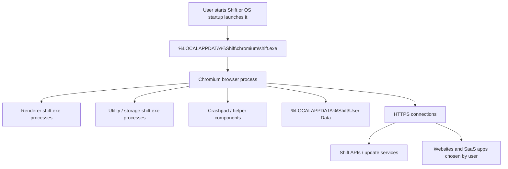
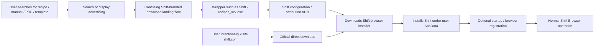
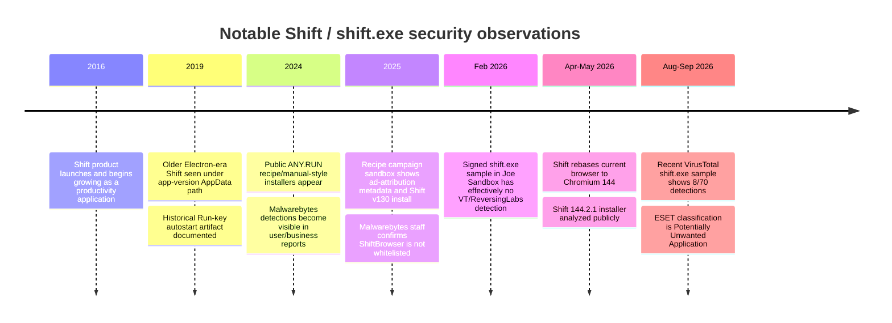

<!--
Research artifact. Current as of 2026-09-02.
Classification: source-backed technical research; not a deployable detection or a malware verdict.
-->

# Deep Research Report: `shift.exe` / Shift Browser Security Assessment

## Executive summary

**Bottom line:** `shift.exe` is principally the **Windows executable for Shift Browser, a legitimate commercial Chromium-based browser produced by Shift Technologies Inc.** Shift is actively distributed by its publisher for Windows and macOS, has current product documentation and release notes, and the Windows product uses `shift.exe` for its browser and Chromium subprocesses. [^src-1][^src-2][^src-3]

At the same time, **“legitimate” does not mean every security vendor considers it desirable**. Malwarebytes explicitly classifies Shift Browser as `PUP.Optional.ShiftBrowser`, stating that it is promoted through confusing advertisements on sites where users search for manuals, recipes, templates, and similar documents, and that Malwarebytes blocks the downloader used to retrieve the actual installer. Public multi-engine results also show some vendors classifying Shift samples as potentially unwanted rather than as conventional Trojan malware. [^src-4][^src-5]

The most accurate classification as of **September 2, 2026** is therefore:

> **Legitimate signed browser software with a material PUA/PUP reputation caused primarily by at least some of its acquisition/distribution channels. Mere presence of a correctly signed `shift.exe` in the normal Shift installation directory is not, by itself, evidence of malware compromise.**

That distinction matters operationally. A current VirusTotal record for SHA-256 `a43d161260bb17ce1e1aec70a145e0420ac29bafd100ef8358c32e30d877a62a` shows **8/70 vendors flagging the file**, while other known Shift binaries have received zero or very few detections in sandbox snapshots. This inconsistent coverage is characteristic of software straddling the legitimate-software/PUA boundary, not a uniformly recognized malware family. [^src-5][^src-6]

There is also substantial evidence for **misleading-ad distribution**. An especially informative January 2025 ANY.RUN analysis captured a wrapper named `shift - recipes_jr739.exe`; its embedded campaign metadata identified `www.tasteofhome.com` as a UTM term, a “recipe” profile, Google-ad attribution fields, and an installer name `shift-v130.0.0-web.exe`, after which it installed the signed Shift browser into `%LOCALAPPDATA%\Shift\chromium\shift.exe`. That observation closely corroborates Malwarebytes' description of document/recipe-oriented advertising. [^src-7][^src-4]

**No persuasive primary-source evidence located in this research establishes that the normal signed Shift Browser itself performs credential theft, cryptomining, ransomware, lateral movement, or purpose-built command-and-control.** Some automated sandboxes assign severe heuristic labels such as “stealer” or “malicious activity” to particular distribution wrappers, but the corresponding traces also show ordinary Chromium/browser functions, installation behavior, imported browser data functionality, and official Shift executables. Those automated labels therefore cannot be treated as proof of malicious exfiltration without corroborating process/network evidence. ANY.RUN itself warns that public analyses can be affected by analyst interaction and do not guarantee maliciousness or safety. [^src-7][^src-8]

There **is a privacy consideration independent of malware**. Shift's current privacy materials say its software may transmit application data including IP address, geolocation, OS/browser/software version, search terms, websites visited, interactions with content or ads, usage statistics, and related data. Shift separately states that imported browser history, bookmarks, and saved passwords remain on the local computer and are not accessible to Shift. Accordingly, a managed enterprise may reasonably reject Shift on privacy, software-governance, shadow-IT, or browser-standardization grounds even when the binary is authentic. [^src-9][^src-10]

**Recommended default incident rating:** an unexpected but authentically signed Shift Browser installation on one endpoint should normally be treated as **medium severity / PUA or unauthorized-software investigation, not a major cyber incident**. Escalate to high or major-incident handling if the binary is unsigned or has an anomalous signer/path, appears with unrelated malware, demonstrates credential-store access inconsistent with browser operation, communicates with unexplained infrastructure, executes offensive scripting tools, spreads laterally, or is deployed unexpectedly at scale. That approach is consistent with NIST's broader principle of integrating incident response with cybersecurity risk management rather than determining severity from a filename or single detection alone. [^src-11]

### Confidence assessment

| Question | Assessment | Confidence |
|---|---|---:|
| Is authentic `shift.exe` legitimate software? | **Yes.** It is the Windows executable of Shift Browser. [^src-12][^src-7] | High |
| Is it a browser component? | **Yes.** The main executable and multiple Chromium renderer/utility processes use `shift.exe`. [^src-7] | High |
| Is it classified as a PUA/PUP? | **Yes, by multiple vendors**, most explicitly Malwarebytes. [^src-4][^src-5] | High |
| Is the authentic browser established malware? | **No convincing evidence found.** Public detections are heavily PUA-oriented and vary by sample. [^src-4][^src-6] | Moderate-high |
| Are misleading distribution channels documented? | **Yes.** Malwarebytes and sandbox traces corroborate recipe/manual/PDF-style acquisition campaigns. [^src-4][^src-7] | High |
| Does it perform malicious credential theft/C2? | **Not established.** Severe sandbox labels exist, but corroborating malware-specific evidence is insufficient. [^src-7][^src-8] | Moderate |
| Should mere discovery trigger a major incident? | **Generally no.** Provenance and behavior should determine escalation. | High analytical confidence |

## Identity, architecture, and normal behavior

### What `shift.exe` actually is

Shift markets its current product as a customizable browser with Apps, Spaces, Builder, and Shift AI, and provides official Windows and macOS downloads. Current documentation states that Shift is built on the **Chromium framework**, while current release notes show the product rebased onto Chromium 144 during 2026. [^src-13][^src-1][^src-2][^src-3]

The architecture has changed over time. Historical Shift material describes older generations as Electron-based, whereas current releases use a more conventional Chromium-derived browser layout. That history explains why older forensic artifacts can look very different from current ones and why an old Shift binary can be tens of megabytes while a current `shift.exe` executable may be only a few megabytes with most browser functionality residing in supporting DLLs and resources. [^src-14][^src-15]

In current Windows sandbox executions, the main process and child processes reside under:

```text
%LOCALAPPDATA%\Shift\chromium\shift.exe
%LOCALAPPDATA%\Shift\chromium\<version>\shift_elf.dll
```

Observed command lines include ordinary Chromium roles such as `--type=renderer` and `--type=utility --utility-sub-type=storage.mojom.StorageService`, with sandbox integrity levels appropriate to Chromium's process isolation model. [^src-7]

The browser profile is stored under:

```text
%LOCALAPPDATA%\Shift\User Data\
```

and Windows crash reports can reside under:

```text
%LOCALAPPDATA%\Shift\User Data\Crashpad\reports
```

Both paths are directly documented by Shift. [^src-16][^src-17]

This is significant for incident triage: **`C:\Users\<user>\AppData\Local\Shift\chromium\shift.exe` is an expected location, not an IOC of malicious compromise in isolation.**

### Security and browser functionality

Shift says its current browser implements Chromium process sandboxing and regular Chromium security updates, local password storage, private browsing, Safe Browsing-style protections, extension protections, and downloaded-file security scanning. Those are publisher claims, but they are consistent with the Chromium-based architecture visible in sandbox process trees. [^src-18][^src-19][^src-2]

Users can explicitly make Shift the default browser; current documentation says that doing so causes links from other applications to open in Shift. Therefore registry/browser capability and HTML-handler artifacts are not inherently evidence of hijacking. [^src-20]

Shift also supports syncing browser configuration such as Spaces and Apps between devices, while some locally stored material remains device-specific. Current official documentation states that passwords, payment methods, custom app icons, and Chrome extensions are not all included in that sync and that substantial local state resides in the Shift application-support folders. [^src-21][^src-22]

### Privacy versus malicious exfiltration

A particularly important analytical distinction is between **declared telemetry** and **malware exfiltration**.

Shift's privacy policy says application data may include:

- IP address and geolocation;
- browser, operating-system, and Shift version;
- usage and statistics;
- terms searched for;
- websites visited;
- interactions with content and advertisements;
- device and bug-report information.

It states that these data can be used for recommendations, personalized content or advertising, usage reporting, product improvement, and measuring marketing initiatives. [^src-10]

The same policy says Shift may import browser search/browsing history, bookmarks, and saved passwords from an existing browser, **but says the imported information remains stored locally and is not collected, viewed, or stored by Shift itself**. [^src-10]

Accordingly, finding HTTPS telemetry from Shift should not automatically be called malicious “data exfiltration.” An organization with restrictive privacy requirements might still regard the declared collection of visited-site/search/advertising interaction data as unacceptable and block the browser as a matter of policy. [^src-9][^src-10]

## File properties, installation, and persistence

### Representative hashes and file characteristics

There is **no single universal hash for `shift.exe`** because the program is versioned and updated frequently; hashes should therefore be used for retrospective hunting and sample correlation, not as a permanent block list. Official release notes confirm continuing browser-engine/version changes. [^src-3]

| Artifact | Representative properties | Interpretation |
|---|---|---|
| `shift.exe` | SHA-256 `a43d161260bb17ce1e1aec70a145e0420ac29bafd100ef8358c32e30d877a62a`; approximately **3.55 MB**; 64-bit PE in the public VT record; **8/70** engines currently flag it. [^src-5] | Current/recent Shift executable; mixed PUA reputation rather than unanimous malware classification. |
| Shift 144.2.1 web/setup wrapper | SHA-256 `241ac450760bb74a1d079918c4336486b8e8733097bb69d152a03f54d8b381bd`; SHA-1 `8e410c67965f1fd6fcbc60c61cc0431531e9a3ae`; MD5 `1bcaa72b2f6f3e621ea663ec52dac810`; **8,871,576 bytes** in one public scanner record. [^src-23][^src-24] | Inno Setup-based Shift 144.2.1 installer/downloader. |
| `shift.exe` sample | SHA-256 `7eb07b23b5d4e43494dacf3861aea980d2d4bddc7191b7a16ca767475e8ab493`; SHA-1 `6d93bdf84c9eaa86d2f696f4b6b3fa91dea02704`; MD5 `be4fd1c6cd497d77962e60fc170b2bc0`; **3,036,528 bytes**. [^src-6] | Valid-certificate sample; Joe Sandbox reported 0% VT/ReversingLabs detection at analysis time. |
| Older `shift.exe` sample | SHA-256 `87817ee55931bdd96f9231a2ecdcebe7e91dc1df29ca00f955837cc4156ab6de`; MD5 `82fc7bf8b7f6dcca3b839eb643a520f4`; **2,426,224 bytes**. [^src-25] | Older browser executable; useful only as historical correlation. |
| Recipe-campaign wrapper | SHA-256 `a290bbdb723ca8cda663fa06ff3f8f382e96c146560536252207ab4b23b609bd`; SHA-1 `ed5cafb23d6716ec151394398db7a55bb22667b3`; MD5 `c04725d25a8b7d9e91f9db0f2b23d7e7`. [^src-7] | Lure-branded installer from a documented advertising campaign; sandbox gave a severe heuristic verdict. |

The 144.2.1 installer identifies itself as `Shift Browser Setup`, product `Shift Browser`, company `Shift Technologies Inc.`, and an Inno Setup installation. [^src-23]

A third-party static report for that sample records an Authenticode signature from **Shift Technologies Inc.** using a DigiCert-associated certificate chain. Because one parser displayed inconsistent chain-validation wording, the safest operational procedure is to validate Authenticode locally rather than rely solely on a sandbox parser. [^src-24]

For example, on a Windows host:

```powershell
Get-AuthenticodeSignature "$env:LOCALAPPDATA\Shift\chromium\shift.exe" |
    Format-List Status, StatusMessage, SignerCertificate, TimeStamperCertificate

Get-FileHash "$env:LOCALAPPDATA\Shift\chromium\shift.exe" -Algorithm SHA256
```

A valid Shift signature is **supporting provenance evidence, not proof of harmlessness**; conversely, an unsigned `shift.exe`, unexpected signer, or invalid signature deserves much greater scrutiny.

### Common filenames and variants

Normal names include:

```text
Shift.exe
shift.exe
Shift Setup.exe
shift-v<version>-installer.exe
shift-v<version>-web.exe
```

Public distribution/sandbox samples demonstrate marketing-lure variants such as:

```text
Shift - recipes_jr739.exe
Shift - recipes_mkr3j.exe
Shift - Manuals_<token>.exe
Shift - PDF_<token>.exe
Shift Setup_<token>.exe
```

The recipe wrapper specifically passed encoded campaign metadata including a `profile` of `recipe`, a referring/search term of `www.tasteofhome.com`, UTM campaign fields, a landing-page URL under Shift, and an installer name `shift-v130.0.0-web.exe`. [^src-26][^src-7]

These names should be treated as **distribution indicators**, not definitive malware IOCs.

There is an additional attribution hazard: `shift.exe` is not globally unique to Shift Browser. Public software inventories have used the same filename for unrelated applications including Need for Speed SHIFT and a historical GIMP component. Filename-only detection is therefore inherently weak. [^src-27][^src-28]

### Installation paths

For the present Windows browser generation, the strongest observed/default location is:

```text
C:\Users\<user>\AppData\Local\Shift\chromium\shift.exe
```

with supporting browser-version files below:

```text
C:\Users\<user>\AppData\Local\Shift\chromium\<version>\
```

and user/profile information below:

```text
C:\Users\<user>\AppData\Local\Shift\User Data\
```

These are corroborated independently by official Shift support content and sandbox process traces. [^src-17][^src-7]

Older releases can differ dramatically. A 2019 Malwarebytes diagnostic log showed an Electron-era installation under:

```text
C:\Users\<user>\AppData\Local\Shift\app-3.8.2\Shift.exe
```

with a much larger executable and a historical Redbrick-related signature. That artifact should not be used as the baseline for current installations. [^src-29]

Current Shift officially supports **Windows 10 or later**, while current macOS documentation specifies macOS 11 Big Sur or newer. Because the subject of this report is specifically the `.exe`, the executable/path discussion primarily applies to Windows; a Mac installation will not expose the same PE executable or Windows persistence artifacts. [^src-12][^src-30]

### Persistence and startup behavior

Shift has an explicit auto-launch capability. Current Shift documentation describes browser launch/on-startup configuration, while prior support material says the auto-launch-at-login setting is enabled by default and can be disabled through Windows Startup Apps. [^src-31]

Historical telemetry shows a traditional per-user Run entry:

```text
HKU\<SID>\Software\Microsoft\Windows\CurrentVersion\Run
    Shift = ...\AppData\Local\Shift\app-<version>\Shift.exe
```

for an older release. [^src-29]

Current builds should **not** be assumed to use precisely that same Run value. The underlying implementation can change between versions, so responders should inspect Startup Apps, `HKCU\...\Run`, scheduled tasks, Startup folders, services, and application-update mechanisms rather than relying on one legacy key.

Sandbox traces also show browser registration/capability artifacts and HTML-file associations, including `Shift Browser` capability information and a `ShiftHTML` handler. Because Shift provides an official “make default browser” function, these artifacts alone do not demonstrate browser hijacking. [^src-32][^src-20]

The resulting normal architecture can be summarized as:



The Chromium child-process structure, profile location, and Shift API connectivity are corroborated by Shift's documentation and public process traces. [^src-7][^src-17][^src-33]

## Network behavior and distribution

### Expected network connections

A web browser naturally has an enormous and user-dependent network footprint. Consequently, there is **no meaningful fixed list of all domains contacted by `shift.exe`**: it will connect to whatever websites, cloud applications, identity providers, extensions, and embedded content the user opens.

The stable publisher infrastructure is more useful.

| Domain / endpoint | Protocol / port | Evidence and interpretation |
|---|---:|---|
| `profile.shiftapis.com` | HTTPS/TCP 443 | Official Shift documentation says this must be reachable. [^src-33][^src-34] |
| `websocket.shiftapis.com` | TCP 443; browser documentation describes HTTPS connectivity | Official required connectivity. The hostname suggests WebSocket functionality, but the documentation cited here explicitly guarantees port 443 rather than defining every application-layer transaction. [^src-33] |
| `updates.shiftapis.com` | HTTPS/TCP 443 | Official Shift update service/allow-list entry. [^src-35] |
| `config.shiftapis.com` | HTTPS/TCP 443 | Observed by ANY.RUN installer contacting `/preflight`, `/splittests`, `/settings`, `/config`, `/features`, and `/ip/`. [^src-23] |
| `cdn77-downloads.tryshift.com` | HTTPS/TCP 443 | Observed serving `shift-v144.2.1-installer.exe`. [^src-23] |
| `attribution.shiftapis.com` | HTTPS/TCP 443 | Observed in older installer/distribution telemetry; likely attribution/marketing related rather than C2. [^src-36] |
| `update.shiftapis.com` | HTTPS/TCP 443 | Historical sandbox observation; distinguish from the currently documented plural `updates.shiftapis.com`. [^src-36] |
| `downloads.tryshift.com` | HTTPS/TCP 443 | Historical installer-download infrastructure. [^src-36] |
| `api.mixpanel.com` | HTTPS | Historical observation consistent with third-party analytics; not malicious by itself. [^src-36] |
| Sentry ingest endpoint | HTTPS | Older Shift process traces show Crashpad/minidump reporting to a Sentry ingest URL; endpoint/key can change and should not be treated as permanent IOC. [^src-37] |

DNS resolution is naturally also expected. The IP addresses behind these domains should **not** be treated as durable IOCs because CDN and cloud-hosted infrastructure changes over time. The US, UK, German, or other server geolocations visible in sandbox reports are infrastructure locations, not evidence of victim geography. [^src-23][^src-36]

There is no documented proprietary “C2 port” for normal Shift Browser. In the researched samples, the important first-party traffic overwhelmingly uses ordinary HTTPS on TCP 443. [^src-33][^src-23]

### Documented acquisition route

The most important threat-intelligence finding is not a browser exploit: it is **advertising/distribution behavior**.

Malwarebytes explicitly states:

- Shift Browser is a potentially unwanted program in its taxonomy;
- it is promoted through confusing advertisements;
- those advertisements appear where people search for manuals, recipes, templates, and other popular documents;
- Malwarebytes blocks the downloader that obtains the actual installer. [^src-4]

Public sandbox records substantially corroborate that description. Observed names include `Shift - recipes...`, `Shift - Manuals...`, and `Shift - PDF...`, with one wrapper carrying extensive advertising/landing-page metadata and proceeding to install an otherwise recognizable Shift browser. [^src-26][^src-7]

The likely documented flow is therefore:



The first branch is supported by Malwarebytes and public campaign telemetry; the second is Shift's normal official installation path. [^src-4][^src-23][^src-12]

### Attack vectors: evidence assessment

| Vector | Evidence | Assessment |
|---|---|---|
| **Official EXE/web installer** | Directly documented by Shift. [^src-12] | **Confirmed legitimate channel** |
| **Confusing/misleading online advertisements** | Explicit Malwarebytes finding; sandbox campaign traces strongly corroborate. [^src-4][^src-7] | **Confirmed / high confidence** |
| **Recipe/manual/PDF/template-themed wrappers** | Multiple public sandbox filenames and campaign metadata. [^src-26][^src-7] | **Confirmed observations** |
| **General software bundling** | Asserted by some secondary removal sites but weakly documented in authoritative reporting reviewed here. [^src-38] | **Possible; low confidence** |
| **MSI enterprise deployment** | No strong public evidence found in this research tying PUA distribution specifically to MSI packages. | **Unsubstantiated** |
| **Phishing attachment** | No primary report located demonstrating Shift itself distributed as a conventional malicious email attachment. | **Unsubstantiated** |
| **Drive-by exploit / silent exploit kit** | No evidence located of exploitation causing Shift installation without a user/download action. | **Unsubstantiated** |
| **Compromised Shift software update** | No credible supply-chain-compromise report located. Shift operates an ordinary update service. [^src-35] | **No evidence found** |

A Reddit/sysadmin report described Shift appearing on a workstation whose user lacked administrator privileges. That is consistent with a per-user `%LOCALAPPDATA%` installation model, but a community report is insufficient to conclude that the software bypasses Windows privilege controls. [^src-39]

## Detection coverage, IOCs, prevalence, and impact

### Vendor-detection comparison

Detection must be interpreted **per hash and per date**. VirusTotal results can change as engines update definitions, and PUA engines frequently apply different policy thresholds.

| Vendor / source | Public result | Interpretation |
|---|---|---|
| **Malwarebytes / ThreatDown** | `PUP.Optional.ShiftBrowser`. Malwarebytes explicitly says Shift Browser is a PUP and documents confusing-ad distribution. [^src-4] | Strongest authoritative PUA classification. |
| **ESET-NOD32** | A public VT result for recent `a43d...` labels it `Win64/ShiftTech.A Potentially Unwanted Application`. [^src-5] | PUA, not conventional Trojan nomenclature. |
| **VirusTotal aggregate** | SHA-256 `a43d...`: **8/70** engines flag the file at the current public snapshot. [^src-5] | Minority detection; does not establish a consensus malware verdict. |
| **Webroot** | Public multi-engine snapshot for `241ac...` reported `Pua.Shiftbrowser`. [^src-24] | PUA classification. |
| **Varist** | `W32/ShiftBrowser.A.gen!Eldorado` on the installer snapshot. [^src-24] | Generic ShiftBrowser detection. |
| **VirIT** | `Deceptor.Shift.EWB` on the same snapshot. [^src-24] | Deceptor/PUA-style designation. |
| **Xcitium** | `ApplicUnwnt@#2jmz4ky9roc2` on one installer; a different recent Shift sample was reported undetected by Xcitium. [^src-24][^src-5] | Strong illustration of sample/version variance. |
| **Google engine** | `Detected` on one `241ac...` multi-engine snapshot. [^src-24] | Generic detection; no precise malware-family attribution. |
| **Bitdefender** | Reported undetected on the `a43d...` VT sample examined. [^src-5] | No detection in that particular snapshot. |
| **ReversingLabs / Joe Sandbox** | A signed `7eb...` browser sample had 0% ReversingLabs and 0% VT detections at the February 2026 Joe analysis. [^src-6] | Installed-browser binaries can be effectively clean to multi-engine scanners. |

This table should **not** be interpreted as “8 vendors say malware and 62 say safe.” VirusTotal is an aggregation system, and engine verdicts vary in PUA policy and timing; a numerical threshold alone is not reliable ground truth. [^src-40][^src-41]

The strongest pattern is that the specific nomenclature available publicly is heavily weighted toward **PUP/PUA/unwanted-app classification**, particularly around installers and acquisition wrappers.

### Automated sandbox verdicts require care

ANY.RUN rated the 144.2.1 installer task “Malicious activity” and triggered signatures including Inno Setup detection, executable dropping, access to an “unwanted program” domain, and external-IP checking. Yet the same trace identifies the publisher as Shift Technologies Inc., calls the artifact `Shift Browser Setup`, and shows it retrieving the Shift installer from Shift-controlled infrastructure. [^src-23]

A January 2025 recipe-themed acquisition task was even labeled “Stealer” and included a generic “actions similar to stealing personal data” heuristic. The underlying trace simultaneously shows the legitimate Shift `130.0.0.1768` Chromium executable running ordinary renderer/storage-service processes. [^src-7]

That does **not** prove the sandbox is “wrong”; it means its high-level category is insufficient to prove credential theft. Browsers naturally manipulate credential/session/browser databases, inspect system configuration, spawn sandboxed processes, import browser state, and perform extensive network activity. A credible stealer finding would require more specific evidence such as extraction/decryption of credentials from other browsers, collection into an archive, transmission to attacker-controlled infrastructure, or a separately identified malicious payload. That corroboration was not established in the reviewed material.

### IOC and hunting table

Most of these are better described as **Indicators of Presence (IOPs)** rather than Indicators of Compromise. First-party Shift infrastructure should not automatically be blocked as “malicious C2.”

| Indicator | Type | Confidence / meaning |
|---|---|---|
| `%LOCALAPPDATA%\Shift\chromium\shift.exe` | Path | **Expected Shift Browser presence indicator.** [^src-7] |
| `%LOCALAPPDATA%\Shift\User Data\` | Profile directory | **Expected.** [^src-17] |
| `%LOCALAPPDATA%\Shift\User Data\Crashpad\reports` | Crash artifacts | **Expected.** [^src-17] |
| `a43d161260bb17ce1e1aec70a145e0420ac29bafd100ef8358c32e30d877a62a` | SHA-256 | Known Shift sample; currently 8/70 VT detections. [^src-5] |
| `241ac450760bb74a1d079918c4336486b8e8733097bb69d152a03f54d8b381bd` | SHA-256 | Shift 144.2.1 installer/wrapper sample. [^src-23] |
| `7eb07b23b5d4e43494dacf3861aea980d2d4bddc7191b7a16ca767475e8ab493` | SHA-256 | Signed browser sample; little/no AV detection in its Joe snapshot. [^src-6] |
| `a290bbdb723ca8cda663fa06ff3f8f382e96c146560536252207ab4b23b609bd` | SHA-256 | Recipe-campaign wrapper; **higher investigative value** than an ordinary installed browser hash. [^src-7] |
| `Shift - recipes_*.exe`, `Shift - PDF_*.exe`, `Shift - Manuals_*.exe` | Filename pattern | Distribution-channel indicator; useful for discovering deceptive-ad acquisition. [^src-4][^src-26] |
| `profile.shiftapis.com` | Domain | Legitimate first-party service. [^src-33] |
| `websocket.shiftapis.com` | Domain | Legitimate first-party service. [^src-33] |
| `updates.shiftapis.com` | Domain | Legitimate update service. [^src-35] |
| `config.shiftapis.com` | Domain | Observed installer/configuration service. [^src-23] |
| `cdn77-downloads.tryshift.com` | Domain | Observed Shift installer CDN. [^src-23] |
| Invalid/no Shift signature + `shift.exe` | Composite condition | **High-value anomaly**; investigate as possible masquerading malware. |
| `shift.exe` in System32, ProgramData, random Temp subfolder, or another unrelated persistence path | Path anomaly | **Suspicious only after determining whether it is an installer/temp artifact or unrelated program.** |
| `shift.exe` spawning PowerShell/cmd/wscript/rundll32 with encoded or remote commands | Behavioral IOC | Not part of normal behavior established in reviewed Shift documentation; warrants immediate malware triage. |

### YARA and signature availability

No authoritative, Shift-specific public YARA family signature was located in the reviewed vendor reporting. One Joe Sandbox analysis of a known Shift binary reported no relevant YARA, Sigma, or Suricata matches, further supporting the conclusion that there is no broadly standardized “Shift malware family” signature. [^src-6]

The following is therefore an **analyst-authored presence/hunting rule**, not a malware verdict:

```yara
rule Hunt_Shift_Browser_Windows_Heuristic
{
    meta:
        description = "Hunts for Windows Shift Browser artifacts; presence != malware"
        author = "OpenAI analytical example"
        date = "2026-09-02"
        confidence = "medium"
        false_positive = "Expected on legitimate Shift Browser installations"

    strings:
        $product  = "Shift Browser" wide ascii nocase
        $company1 = "Shift Technologies Inc." wide ascii nocase
        $company2 = "Shift Technologies, Inc." wide ascii nocase
        $api      = "shiftapis.com" wide ascii nocase
        $chromium = "shift_elf.dll" wide ascii nocase

    condition:
        uint16(0) == 0x5A4D and
        $product and
        1 of ($company*) and
        1 of ($api, $chromium)
}
```

The strings are based on publisher/product metadata, first-party API infrastructure, and observed Chromium components in public Shift samples. [^src-23][^src-7][^src-33]

For actual compromise detection, behavior-oriented logic is preferable. For example, an EDR hunt should prioritize a process named `shift.exe` that **fails signer/path validation and then performs credential dumping, scripting, injection, or unusual remote communications**, rather than alerting on the filename alone.

### Prevalence

Reliable independent prevalence data are unusually sparse.

Shift itself claims roughly **2.4 million monthly users**. That is publisher-reported marketing data, not independently measured PUA telemetry, so it establishes that Shift is not an obscure one-off binary but should not be used as an estimate of potentially unwanted installations. [^src-42]

The product is officially available on Windows and macOS and is designed for general productivity, multi-account use, applications, and work/personal Spaces. [^src-1][^src-13]

What could **not** be established from reliable sources is more important:

| Prevalence dimension | Research conclusion |
|---|---|
| Number of PUA installations | **No reliable independent estimate found.** |
| Infection rate per endpoint population | **No reliable telemetry found.** |
| Geography of unwanted installations | **No trustworthy country distribution found.** |
| Most affected industries | **No defensible quantitative sector breakdown found.** |
| Windows 10 vs. Windows 11 incidence | **No credible comparative prevalence data found.** |
| Enterprise vs. consumer prevalence | Public sysadmin/business reports show it appears in managed environments, but these anecdotes cannot quantify prevalence. [^src-39][^src-43] |

A sandbox running Windows 10, or a CDN resolving to a US/UK/German IP, must not be transformed into a claim about victim geography or operating-system prevalence. Public malware sandboxes are analyst-selected test environments, not population samples. [^src-7][^src-23]

### Observed impact

The evidence can be divided into well-established effects and unsubstantiated malware claims.

**Established or well-supported:** Shift can install a full Chromium browser into the user's local profile, register browser capabilities, run at login, make itself the default browser when configured, generate multiple browser processes, communicate with Shift services and arbitrary websites, collect the application/usage data described in its privacy policy, and consume normal browser CPU/memory/network resources. [^src-20][^src-31][^src-7][^src-10]

**Potentially unwanted operational effect:** in an enterprise, an unexpected second browser expands the software inventory, attack surface, patch-management responsibility, extension ecosystem, credential/session footprint, and data-governance scope. Shift's own documentation confirms it maintains browser profiles, passwords, extensions, browser history and app/session state locally, so an unmanaged instance creates another store of potentially sensitive browser material. [^src-21][^src-18]

**Not established in the authentic browser samples reviewed:** ransomware, cryptocurrency mining, lateral movement, destructive payloads, keylogging, arbitrary code-execution backdoors, or dedicated attacker C2.

**Credential/data stealing:** automated sandboxes generated stealer-like heuristics for at least one acquisition flow, but the evidence reviewed does not establish malicious credential exfiltration by the signed browser. Shift's official privacy policy does establish substantial application telemetry, including visited websites and search terms, which is a privacy concern but is analytically different from covert credential theft. [^src-7][^src-10]

## Detection timeline and analytical interpretation

The timeline demonstrates why treating every `shift.exe` as one immutable malware sample produces poor conclusions.



Shift's historical architecture, the 2019 forensic artifact, 2024–2025 distribution traces, current Chromium release information, and 2026 multi-engine results support this sequence. [^src-44][^src-29][^src-26][^src-7][^src-43][^src-6][^src-3][^src-23][^src-5]

The key analytical lesson is **sample context**:

1. **Official-browser binary:** expected path + valid Shift signature + normal Chromium child processes + first-party Shift infrastructure → likely legitimate Shift Browser.
2. **PUA acquisition wrapper:** recipe/manual/PDF-branded executable + advertising metadata + downstream Shift installer → unwanted/deceptive distribution, but not necessarily a secondary malware payload.
3. **Masquerading malware:** `shift.exe` with wrong/no signer, wrong product metadata, anomalous path, attacker infrastructure or malicious behavior → treat as unrelated malware using the filename until disproved.

That triage model better explains the heterogeneous public-detection results than the simplistic question “is `shift.exe` a virus?”

## Remediation, containment, and incident classification

### Recommended investigation sequence

Because no environment details were supplied, the following is intentionally platform- and enterprise-policy-neutral. Windows-specific steps apply to the `.exe` artifact; macOS requires the corresponding Shift application-support and application-bundle investigation.

First preserve provenance before deleting anything. Record the executable's full path, SHA-256, file creation/modification times, Authenticode signer and certificate chain, parent process or installation source, user responsible, browser/default-app changes, startup mechanism, and network activity around first execution. This is particularly valuable because the strongest PUA concern is **how Shift arrived**, not merely whether a Shift executable exists. Malwarebytes' documented advertising route makes browser/download/referrer history especially useful. [^src-4][^src-7]

On Windows, useful validation commands include:

```powershell
$shift = "$env:LOCALAPPDATA\Shift\chromium\shift.exe"

if (Test-Path $shift) {
    Get-Item $shift | Select-Object FullName, Length, CreationTimeUtc, LastWriteTimeUtc

    Get-FileHash $shift -Algorithm SHA256

    Get-AuthenticodeSignature $shift |
        Select-Object Status, StatusMessage,
            @{n='Signer';e={$_.SignerCertificate.Subject}},
            @{n='Issuer';e={$_.SignerCertificate.Issuer}}
}

Get-CimInstance Win32_StartupCommand |
    Where-Object {
        $_.Command -match '(?i)shift' -or $_.Name -match '(?i)shift'
    } |
    Select-Object Name, Command, Location, User
```

Then examine the source-of-install trail: browser download history, URL/referrer telemetry, Windows execution events, EDR process ancestry, proxy/DNS records, and files named `Shift - recipes_*`, `Shift - PDF_*`, `Shift - Manuals_*`, or similar. Those names have considerably more value for identifying the questionable advertising channel than the normal installed path does. [^src-4][^src-26][^src-7]

### Response actions by severity

| Severity | Example conditions | Recommended response |
|---|---|---|
| **Informational / Low** | User intentionally installed Shift from the publisher; valid expected signer; `%LOCALAPPDATA%\Shift\chromium\shift.exe`; network activity consistent with Shift/browser use; software is permitted by policy. [^src-12][^src-7] | Inventory it, ensure current version/patching, evaluate privacy policy and browser governance, and close as authorized software if acceptable. |
| **Medium — recommended default for unexplained discovery** | User does not remember installing it; PUA detection; startup enabled; recipe/PDF/manual advertising history; otherwise authentic Shift binaries and no secondary malware evidence. [^src-4][^src-31] | Isolate only if organizational policy requires it; preserve installation provenance; uninstall Shift; remove residual startup/browser registrations and profile data where appropriate; scan endpoint; hunt the same acquisition filenames/referrers fleet-wide; consider blocking unauthorized browser installation. |
| **High** | Invalid/unexpected signer, execution outside plausible Shift paths, high-confidence malware detections unrelated to PUA, suspicious PowerShell/script children, process injection, credential-database collection, unexplained remote infrastructure, or bundled secondary payload. | Network-isolate host; preserve volatile and disk evidence; acquire EDR timeline; reset credentials if credential access occurred; block confirmed malicious hashes/domains; hunt across endpoints; investigate initial-access mechanism. |
| **Critical / Major incident candidate** | Confirmed credential theft or data exfiltration at scale; lateral movement; ransomware/destructive behavior; widespread malicious deployment; privileged-account compromise; evidence the legitimate Shift update/signing/distribution chain itself was compromised. | Activate major-incident/CSIRT procedures, enterprise containment, identity containment, executive/legal/privacy communications as applicable, threat hunting, forensic imaging, scope determination, recovery and post-incident review. |

This is a proposed risk matrix rather than an official Shift or NIST severity scale. It follows NIST's current incident-response framing in which response is integrated with organizational cybersecurity risk management and should address the actual impact and scope of an event. [^src-11]

### Removal and containment

For an authentic but unauthorized Shift installation, the preferred order is:

**Preserve evidence → uninstall normally → remove residual data only after deciding whether evidence is needed → verify startup/default-browser state → rescan.**

Shift officially supports removal through the Windows application-uninstall mechanism. Its user data resides under `%LOCALAPPDATA%\Shift\User Data`; wiping that directory destroys locally stored application data, so responders should preserve it first when an incident investigation is underway. [^src-45][^src-16]

After uninstalling, verify:

```text
%LOCALAPPDATA%\Shift\
```

is absent or contains only deliberately preserved forensic material; inspect Windows Startup Apps and Run keys; confirm the organization's authorized default browser; inspect HTML/HTTP/HTTPS associations; remove unwanted shortcuts; and check whether the same user downloaded lure-branded installers. Historical and current artifacts demonstrate that startup and browser-registration state can persist independently of the obvious desktop shortcut. [^src-29][^src-32][^src-20]

In an enterprise, consider software-restriction/AppLocker/WDAC or EDR application-control policies against **unauthorized Shift publisher/product execution**, rather than blindly blocking every hash: frequent releases make hash-only controls brittle. The decision to block first-party `shiftapis.com` infrastructure should similarly be based on software policy; those domains are legitimate Shift services, and blocking them will impair the application. [^src-33][^src-35]

If the provenance indicates a misleading ad, the broader containment task is to determine whether that same ad/download ecosystem delivered anything else. The investigation should pivot on the referrer, downloaded wrapper, browser history, campaign identifiers and adjacent downloads rather than assuming Shift itself was the terminal malicious payload. [^src-4][^src-7]

### Should this be declared a major incident?

**Not on the basis of `shift.exe` alone.**

For a correctly signed, expected-path Shift installation, even one detected as `PUP.Optional.ShiftBrowser`, the evidence supports classification as **PUA/shadow IT/browser-governance risk**, not automatically a malware outbreak. Malwarebytes itself describes its protection as blocking the downloader so that the user can make an informed decision about installing the program, which is materially different from its characterization of an unequivocal credential stealer, ransomware family, or backdoor. [^src-4]

A **major-incident declaration becomes justified** when there is additional evidence of material organizational impact, particularly:

- widespread unauthorized deployment across many endpoints;
- compromise of privileged or sensitive accounts;
- confirmed theft/exfiltration of credentials or protected information;
- lateral movement or persistence attributable to a malicious actor;
- destructive effects or severe business interruption;
- compromise of Shift's authentic signing/update chain;
- or evidence that an attacker deliberately masqueraded malware as `shift.exe` and achieved material scope.

Those escalation criteria intentionally focus on **scope, business impact and adversarial behavior**, rather than the vendor name or number of antivirus flags, consistent with risk-oriented incident-response practice. [^src-11]

### Final risk recommendation

For an unspecified environment, I would assign the following baseline:

**Authentic, expected-path, knowingly installed Shift Browser: Low security-incident risk / potentially moderate privacy and governance risk.**

**Authentic but unexplained Shift Browser obtained via a recipe/manual/PDF advertising flow: Medium risk, classify as PUA/unauthorized-software incident and investigate the acquisition channel.** Malwarebytes' official PUP classification and observed campaign wrappers justify more than a simple “false positive” dismissal. [^src-4][^src-7]

**Unsigned, wrong-signer, abnormal-path `shift.exe`, or Shift associated with independently malicious behavior: High risk until proven otherwise.** The filename is too generic to establish provenance, and unrelated software has historically also used `shift.exe`. [^src-27][^src-28]

**Confirmed compromise, exfiltration, lateral movement or widespread malicious deployment: Critical / major incident.**

The overall analytical conclusion is therefore **not “Shift is malware,” and not “every detection is a false positive.”** The evidence instead supports a more nuanced and operationally useful judgment: **Shift Browser is real, current, signed browser software whose documented advertising/distribution practices have caused reputable security products to classify it as potentially unwanted. The installed browser should be validated by signature, path, provenance and behavior; unexpected installations warrant investigation, but mere presence of authentic `shift.exe` is insufficient to infer compromise.** [^src-12][^src-4][^src-5]

## Sources
[^src-1]: [Download Shift Browser for Free – Get Started Today](https://shift.com/download/) — shift.com. Accessed 2026-09-02.
[^src-2]: [Security in Shift Browser](https://support.shift.com/hc/en-us/articles/24813266870420-Security-in-Shift-Browser) — support.shift.com. Accessed 2026-09-02.
[^src-3]: [Release Notes](https://support.shift.com/hc/en-us/sections/24767182907796-Release-Notes) — support.shift.com. Accessed 2026-09-02.
[^src-4]: [PUP.Optional.ShiftBrowser - Malwarebytes Threat Alert](https://www.malwarebytes.com/blog/detections/pup-optional-shiftbrowser) — malwarebytes.com. Accessed 2026-09-02.
[^src-5]: [a43d161260bb17ce1e1aec70a1...](https://www.virustotal.com/gui/file/a43d161260bb17ce1e1aec70a145e0420ac29bafd100ef8358c32e30d877a62a/gti-summary) — virustotal.com. Accessed 2026-09-02.
[^src-6]: [Automated Malware Analysis Report for shift.exe - Generated by Joe Sandbox](https://www.joesandbox.com/analysis/1874208/0/html) — joesandbox.com. Accessed 2026-09-02.
[^src-7]: [Malware analysis app.shift.com/shift/download/shift%20-%20recipes_jr739.exe?installer=shift-v130.0.0-web.exe Malicious activity | ANY.RUN - Malware Sandbox Online](https://any.run/report/a290bbdb723ca8cda663fa06ff3f8f382e96c146560536252207ab4b23b609bd/97e1d4d4-c62a-4274-b990-6109e4835b7c) — any.run. Accessed 2026-09-02.
[^src-8]: [Malware analysis http://app.shift.com/shift/download/shift% ...](https://any.run/report/d64637b544a4435cface8140deea651bada4b378aed4e815c80e16162650a86a/49d3c61c-7487-403c-b0d0-ef24fab9df9f) — any.run. Accessed 2026-09-02.
[^src-9]: [Shift Privacy Policy FAQ](https://support.shift.com/hc/en-us/articles/24813163898644-Shift-Privacy-Policy-FAQ) — support.shift.com. Accessed 2026-09-02.
[^src-10]: [Privacy Policy](https://shift.com/legal/privacy-policy-v9/) — shift.com. Accessed 2026-09-02.
[^src-11]: [Incident Response](https://csrc.nist.gov/projects/incident-response) — csrc.nist.gov (2024-02-29). Accessed 2026-09-02.
[^src-12]: [How to install Shift Browser on Windows](https://support.shift.com/hc/en-us/articles/24763857845524-How-to-install-Shift-Browser-on-Windows) — support.shift.com. Accessed 2026-09-02.
[^src-13]: [Shift Browser | Drag and Drop. Build Your Custom Browser](https://shift.com/) — shift.com. Accessed 2026-09-02.
[^src-14]: [Auto-hibernate, the feature that speeds up your work](https://shift.com/blog/auto-hibernate-feature-difference-work/) — shift.com. Accessed 2026-09-02.
[^src-15]: [Redbrick Launches Shift 2.0 With Chrome Extensions - Redbrick](https://www.rdbrck.com/whats-new/redbrick-launches-shift-2-0-with-chrome-extensions) — rdbrck.com. Accessed 2026-09-02.
[^src-16]: [How to perform a full app data reset (Windows)](https://support.shift.com/hc/en-us/articles/39140674221844-How-to-perform-a-full-app-data-reset-Windows) — support.shift.com. Accessed 2026-09-02.
[^src-17]: [What to do if Shift Browser is crashing](https://support.shift.com/hc/en-us/articles/49715893615380-What-to-do-if-Shift-Browser-is-crashing) — support.shift.com. Accessed 2026-09-02.
[^src-18]: [Shift Browser safety tools](https://support.shift.com/hc/en-us/articles/38717962780180-Shift-Browser-safety-tools) — support.shift.com. Accessed 2026-09-02.
[^src-19]: [Security](https://shift.com/security/) — shift.com. Accessed 2026-09-02.
[^src-20]: [How to set Shift Browser as your default browser](https://support.shift.com/hc/en-us/articles/24805879383316-How-to-set-Shift-Browser-as-your-default-browser) — support.shift.com. Accessed 2026-09-02.
[^src-21]: [How to perform a Full App Data reset (Mac)](https://support.shift.com/hc/en-us/articles/39167827275540-How-to-perform-a-Full-App-Data-reset-Mac) — support.shift.com. Accessed 2026-09-02.
[^src-22]: [Using Shift on multiple computers](https://support.shift.com/hc/en-us/articles/39202850669716-Using-Shift-on-multiple-computers) — support.shift.com. Accessed 2026-09-02.
[^src-23]: [Malware analysis /shift/download/Shift Malicious activity | ANY.RUN - Malware Sandbox Online](https://any.run/report/241ac450760bb74a1d079918c4336486b8e8733097bb69d152a03f54d8b381bd/2d124ba4-7be2-4243-86ff-17a206f4cc0e) — any.run. Accessed 2026-09-02.
[^src-24]: [A Análise do Arquivo Shift - PDF_xy9p93.exe (Shift Browser Setup)](https://pt.gridinsoft.com/online-virus-scanner/id/241ac450760bb74a1d079918c4336486b8e8733097bb69d152a03f54d8b381bd) — pt.gridinsoft.com. Accessed 2026-09-02.
[^src-25]: [shift.exe - powered by Falcon Sandbox](https://hybrid-analysis.com/sample/87817ee55931bdd96f9231a2ecdcebe7e91dc1df29ca00f955837cc4156ab6de/673cf9f809e057df8f071428) — hybrid-analysis.com. Accessed 2026-09-02.
[^src-26]: [shift/download/shift%20-%20recipes_mkr3j.exe](https://any.run/report/53c620082f8e9ac1c0d3ec4def4546bc47410bd3d4fc812f0ea4445e11452f2a/3bdd34ea-ee22-4abc-af24-5a34b9418ce0) — any.run. Accessed 2026-09-02.
[^src-27]: [shift.exe Windows process - What is it?](https://www.file.net/process/shift.exe.html) — file.net. Accessed 2026-09-02.
[^src-28]: [What is remove shift.exe Malware](https://file-intelligence.comodo.com/windows-process-virus-malware/exe/shift) — file-intelligence.comodo.com. Accessed 2026-09-02.
[^src-29]: [Persistent Malware Been Happening for a Very Long Time](https://forums.malwarebytes.com/topic/249982-persistent-malware-been-happening-for-a-very-long-time/) — forums.malwarebytes.com. Accessed 2026-09-02.
[^src-30]: [How to Install Shift Browser on Mac](https://support.shift.com/hc/en-us/articles/39202663785236-How-to-Install-Shift-Browser-on-Mac) — support.shift.com. Accessed 2026-09-02.
[^src-31]: [All about Shift Launch and On-Startup settings – Shift Browser](https://support.shift.com/hc/en-us/articles/24812708192148-All-about-Shift-Launch-and-On-Startup-settings) — support.shift.com. Accessed 2026-09-02.
[^src-32]: [Malware analysis Shift - Manuals_eq1bs.exe Malicious ...](https://any.run/report/e513ff0a7568ec29fa809f87b69368b3fb3ca8096fbc1e8da10b9bab082c8360/a8d189cf-093d-45c5-8ab2-0948e9aaf072) — any.run. Accessed 2026-09-02.
[^src-33]: [What to do if you run into a "problem communicating ... - Shift v9](https://supportv9.shift.com/hc/en-us/articles/25227794458772-What-to-do-if-you-run-into-a-problem-communicating-with-the-Shift-servers-error) — supportv9.shift.com. Accessed 2026-09-02.
[^src-34]: [Trouble downloading the Shift Browser? Here's what to do](https://support.shift.com/hc/en-us/articles/38580847547924-Trouble-downloading-the-Shift-Browser-Here-s-what-to-do) — support.shift.com. Accessed 2026-09-02.
[^src-35]: [Fix Shift update problems & failed updates](https://support.shift.com/hc/en-us/articles/34159263710996-Fix-Shift-update-problems-failed-updates) — support.shift.com. Accessed 2026-09-02.
[^src-36]: [Malware analysis Shift - Manuals_vbhd5.exe Malicious ...](https://any.run/report/940d9189eaee03f452df38dd24a5dcb69d5478edcdaba648de5fb279829bb3c8/0988d556-cb16-4d31-8d49-5a087ed848b0) — any.run. Accessed 2026-09-02.
[^src-37]: [Malware analysis Shift - PDF_jgqf4.exe Malicious activity](https://any.run/report/446262c04a0809efd68a55713cbfbe5d8f78acf606f2c7f2a27532407681ee93/7dfcc7a7-1fb3-4fa6-8135-18b672bb6eb7) — any.run. Accessed 2026-09-02.
[^src-38]: [How to remove Shift unwanted application](https://www.pcrisk.com/removal-guides/35267-shift-unwanted-application) — pcrisk.com. Accessed 2026-09-02.
[^src-39]: [Shift Browser installed on users computer without admin privs](https://www.reddit.com/r/sysadmin/comments/1gv8vgx/shift_browser_installed_on_users_computer_without/) — reddit.com. Accessed 2026-09-02.
[^src-40]: [Exploring the VirusTotal Dataset | An Analyst's Guide to ...](https://www.sentinelone.com/labs/exploring-the-virustotal-dataset-an-analysts-guide-to-effective-threat-research/) — sentinelone.com. Accessed 2026-09-02.
[^src-41]: [Maat: Automatically Analyzing VirusTotal for Accurate Labeling and Effective Malware Detection](https://arxiv.org/abs/2007.00510) — arxiv.org. Accessed 2026-09-02.
[^src-42]: [2700+ Real User Reviews](https://shift.com/reviews/) — shift.com. Accessed 2026-09-02.
[^src-43]: [False Positive: Shift Browser - File Detections](https://forums.malwarebytes.com/topic/324555-false-positive-shift-browser/) — forums.malwarebytes.com. Accessed 2026-09-02.
[^src-44]: [Our Company - Redbrick](https://rdbrck.com/company) — rdbrck.com. Accessed 2026-09-02.
[^src-45]: [How to uninstall Shift Browser on Windows](https://support.shift.com/hc/en-us/articles/24805683019028-How-to-uninstall-Shift-Browser-on-Windows) — support.shift.com. Accessed 2026-09-02.
